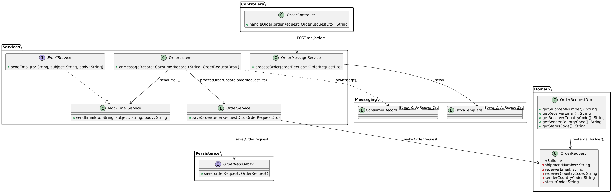

# Design Coding Task - Order Processing API

This project implements a simple **Order Processing API** that allows receiving and processing orders, including saving
the order data in a PostgreSQL database and sending order-related information asynchronously via Kafka and email. The
application is built using the latest Java, Spring Boot, Kafka, PostgreSQL, and Docker technologies.

## Table of Contents

1. [Technologies Used](#technologies-used)
2. [Setup and Installation](#setup-and-installation)
3. [Architecture Description](#Architecture Description:)
4. [Order Flow](#Order Flow Description)

## Technologies Used

### 1. **Java 21**

- This project uses **Java 21**, the latest version of the Java programming language, which provides performance
  improvements, enhanced language features, and greater support for modern applications.

### 2. **Spring Boot 3.2.3**

- **Spring Boot** is the framework used to create this RESTful API. It simplifies the development process by providing
  production-ready features and default configurations for web services, including a built-in embedded web server.
- Version 3.2.3 of Spring Boot is used, providing improvements over previous versions and support for the latest Java 21
  features.

### 3. **Apache Kafka**

- **Apache Kafka** is used for asynchronous messaging in this project. Kafka is a distributed event streaming platform
  that helps manage high-throughput data communication between microservices.
- Kafka is used to send processed order information to various systems asynchronously. This helps decouple the
  components and allows for better scalability and fault tolerance.

### 4. **PostgreSQL**

- **PostgreSQL** is used as the relational database for storing order data. Spring Data JPA is used to interact with the
  PostgreSQL database, providing an easy and robust way to manage entities and repositories.
- The `OrderRequestDTO` is mapped to an `Order` entity and saved into PostgreSQL for persistence.

### 5. **Docker**

- **Docker** is used for containerizing the application, ensuring it runs consistently across different environments.
- The project includes a **Dockerfile** and **docker-compose.yml** to easily build and run the application inside a
  Docker container, along with the required PostgreSQL database container.

### Key Components:

- **OrderController**: REST controller that exposes an endpoint for receiving orders via a POST request.
- **OrderService**: Contains the business logic for processing orders, saving them to the database, and sending emails
  asynchronously.
- **OrderRequestDTO**: Data Transfer Object (DTO) representing the incoming order details from the client.
- **Kafka Integration**: Kafka is used to send order details to an asynchronous messaging system.
- **PostgreSQL Integration**: The application stores order data in a PostgreSQL database using Spring Data JPA.

## Setup and Installation

### Prerequisites

- **Java 21** (JDK 21) installed.
- **Docker** installed on your system to run PostgreSQL and the application inside containers.

### Step 1: Clone the Repository

Clone this project to your local machine:

```bash
git clone https://github.com/JWoinski/designCodingTask.git
cd designTask
docker-compose up --build
```

### Configuration in application.properties

You can modify the configuration in the src/main/resources/application.properties file to adjust any settings (e.g.,
Kafka, database, or email service configurations).

### Run the Application:

After the Docker containers are up and running, the application will be available on http://localhost:8080/api/orders.

To receive an order, you can make a POST request to /api/orders with a JSON payload that matches the OrderRequestDTO
structure.

### Example Request Body:

```
{
  "shipmentNumber": "shipment123",
  "receiverEmail": "receiver@example.com",
  "receiverCountryCode": "PL",
  "senderCountryCode": "US",
  "statusCode": 0
}
```

### Example Response:

```
{
  "message": "Order received and processed."
}
```

## Architecture Description:



# OrderFlow Description

This document describes the full flow of the order processing system, covering how an order request is received,
processed, and logged, including interactions with Kafka and email notifications.

## **Flow Overview**

1. **Step 1:** Client sends an HTTP POST request to the endpoint `POST /api/orders` with the order details in the body.
2. **Step 2:** The `OrderController` processes the request and sends the order to the Kafka topic `order-requests` using
   the `OrderMessageService`.
3. **Step 3:** Kafka propagates the message, and the `OrderListener` listens for messages from the topic.
4. **Step 4:** Upon receiving the message, the `OrderListener` processes it by:

- Saving the order to the database through the `OrderService`
- Sending a confirmation email via the `MockEmailService`

## **Detailed Flow**

### 1. **Receiving the Order Request**

**Controller:** `OrderController`

- **Endpoint:** `POST /api/orders`
- **Method:** `handleOrder`
- **Description:** This endpoint accepts an order request (`OrderRequestDTO`) and forwards it to Kafka using the
  `OrderMessageService`.

```java

@PostMapping
public ResponseEntity<ApiResponse<String>> handleOrder(@Valid @RequestBody OrderRequestDTO orderRequest) {
    orderMessageService.processOrder(orderRequest);
    return new ResponseEntity<>(new ApiResponse<>("Order has been received."), HttpStatus.OK);
}
```

### 2. **Sending the Order to Kafka**

**Service:** `OrderMessageService`

- **Method:** `processOrder`
- **Kafka Topic:** `order-requests`
- **Description:** Sends the order message asynchronously to the Kafka topic.

```java

@Async("asyncTaskExecutor")
public void processOrder(OrderRequestDTO orderRequest) {
    kafkaTemplate.send(ORDER_TOPIC, orderRequest);
}
```

### 3. **Listening for Kafka Messages**

**Service:** `OrderListener`

- **Kafka Listener:** Listens for messages on the `order-requests` topic.
- **Method:** `onMessage`
- **Description:** Processes the received message by saving it to the database and sending an email confirmation.

```java

@KafkaListener(
        topics = ORDER_REQUEST_TOPIC,
        groupId = ORDER_REQUEST_GROUP,
        containerFactory = ORDER_REQUEST_CONTAINER_FACTORY
)
public void onMessage(ConsumerRecord<String, OrderRequestDTO> record) {
    Optional.ofNullable(record.value()).ifPresentOrElse(
            orderRequestDto -> {
                orderService.saveOrderLog(orderRequestDto);
                emailService.sendEmail(
                        orderRequestDto.getReceiverEmail(),
                        "Order confirmation",
                        "Your order " + orderRequestDto.getShipmentNumber() + " has been received",
                        orderRequestDto.getStatusCode()
                );
            },
            () -> {
                throw new OrderProcessingException("Received null OrderRequestDto");
            }
    );
}
```

### 4. **Saving the Order to the Database**

**Service:** `OrderService`

- **Method:** `saveOrderLog`
- **Description:** Converts the DTO to an entity and saves it in the database using `OrderRepository`.

```java
public void saveOrderLog(OrderRequestDTO orderRequestDto) {
    if (orderRequestDto != null) {
        orderRepository.save(modelMapper.map(orderRequestDto, OrderRequest.class));
    }
}
```

### 5. **Sending Email Confirmation**

**Service:** `MockEmailService` (implements `EmailService`)

- **Method:** `sendEmail`
- **Description:** Sends an email with the order confirmation.

```java

@Override
public void sendEmail(String to, String subject, String body, int code) {
    String statusDescription = getStatusDescription(code);
    System.out.println("Email to " + to + " has been sent.");
    System.out.println("Subject: " + subject);
    System.out.println("Body: " + body);
    System.out.println("Order status: " + statusDescription);
}
```

## **Summary of Key Components**

| Component             | Responsibility                                 |
|-----------------------|------------------------------------------------|
| `OrderController`     | Handles incoming HTTP POST requests            |
| `OrderMessageService` | Sends order messages to Kafka asynchronously   |
| `OrderListener`       | Listens to Kafka messages and processes orders |
| `OrderService`        | Saves orders to the database                   |
| `OrderRepository`     | Repository for saving and retrieving orders    |
| `MockEmailService`    | Sends email notifications                      |

