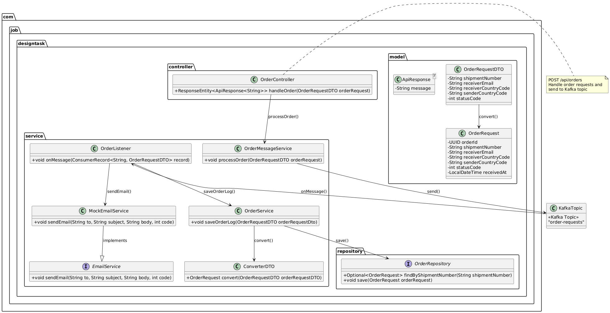

# Design Coding Task - Order Processing API

This project implements a simple **Order Processing API** that allows receiving and processing orders, including saving
the order data in a PostgreSQL database and sending order-related information asynchronously via Kafka and email. The
application is built using the latest Java, Spring Boot, Kafka, PostgreSQL, and Docker technologies.

## Table of Contents

1. [Technologies Used](#technologies-used)
2. [Setup and Installation](#setup-and-installation)
3. [Architecture Description](#Architecture Description:)
4. [Order Flow](#Order Flow Description)


## Technologies Used

### 1. **Java 21**

- This project uses **Java 21**, the latest version of the Java programming language, which provides performance
  improvements, enhanced language features, and greater support for modern applications.

### 2. **Spring Boot 3.2.3**

- **Spring Boot** is the framework used to create this RESTful API. It simplifies the development process by providing
  production-ready features and default configurations for web services, including a built-in embedded web server.
- Version 3.2.3 of Spring Boot is used, providing improvements over previous versions and support for the latest Java 21
  features.

### 3. **Apache Kafka**

- **Apache Kafka** is used for asynchronous messaging in this project. Kafka is a distributed event streaming platform
  that helps manage high-throughput data communication between microservices.
- Kafka is used to send processed order information to various systems asynchronously. This helps decouple the
  components and allows for better scalability and fault tolerance.

### 4. **PostgreSQL**

- **PostgreSQL** is used as the relational database for storing order data. Spring Data JPA is used to interact with the
  PostgreSQL database, providing an easy and robust way to manage entities and repositories.
- The `OrderRequestDTO` is mapped to an `Order` entity and saved into PostgreSQL for persistence.

### 5. **Docker**

- **Docker** is used for containerizing the application, ensuring it runs consistently across different environments.
- The project includes a **Dockerfile** and **docker-compose.yml** to easily build and run the application inside a
  Docker container, along with the required PostgreSQL database container.

### Key Components:

- **OrderController**: REST controller that exposes an endpoint for receiving orders via a POST request.
- **OrderService**: Contains the business logic for processing orders, saving them to the database, and sending emails
  asynchronously.
- **OrderRequestDTO**: Data Transfer Object (DTO) representing the incoming order details from the client.
- **Kafka Integration**: Kafka is used to send order details to an asynchronous messaging system.
- **PostgreSQL Integration**: The application stores order data in a PostgreSQL database using Spring Data JPA.

## Setup and Installation

### Prerequisites

- **Java 21** (JDK 21) installed.
- **Docker** installed on your system to run PostgreSQL and the application inside containers.

### Step 1: Clone the Repository

Clone this project to your local machine:

```bash
git clone https://github.com/JWoinski/designCodingTask.git
cd designTask
docker-compose up --build
```

### Configuration in application.properties

You can modify the configuration in the src/main/resources/application.properties file to adjust any settings (e.g.,
Kafka, database, or email service configurations).

### Run the Application:

After the Docker containers are up and running, the application will be available on http://localhost:8080/api/orders.

To receive an order, you can make a POST request to /api/orders with a JSON payload that matches the OrderRequestDTO
structure.

### Example Request Body:

```
{
  "shipmentNumber": "shipment123",
  "receiverEmail": "receiver@example.com",
  "receiverCountryCode": "PL",
  "senderCountryCode": "US",
  "statusCode": 0
}
```

### Example Response:

```
{
  "message": "Order received and processed."
}
```

## Architecture Description:



# Order Flow Description

Below is a step-by-step overview of what happens in the system when a request to create an order is processed. You can
include the following information in your **README.md** file to explain how the application works.

---

## 1. Client sends a `POST /api/orders` request

- The request body contains an `OrderRequestDto` object (including, among others, `shipmentNumber`, `receiverEmail`,
  `countryCode`, etc.).

## 2. Request received by `OrderController`

- The method `handleOrder(orderRequestDto: OrderRequestDto)` receives the incoming request data.
- The controller serves as the entry point to the application—this is where the business logic begins.

## 3. Passing the request to `OrderMessageService`

- After the `OrderRequestDto` is received, the controller calls the `processOrder(orderRequestDto)` method in the
  service layer responsible for asynchronous communication.
- `OrderMessageService` sends a message to Kafka by using `kafkaTemplate.send()`.

## 4. Publishing a message to Kafka

- The `OrderRequestDto` data is wrapped into a `ConsumerRecord<String, OrderRequestDto>` object and sent to the
  appropriate Kafka topic.

## 5. Message consumed by `OrderListener`

- `OrderListener` listens (subscribes) to the specified Kafka topic.
- Once a new message arrives, the method `onMessage(record: ConsumerRecord<String, OrderRequestDto>)` is invoked.

## 6. Processing the order in `OrderListener`

- Inside `onMessage`, the `OrderRequestDto` is read and the following actions take place:
    - **(a)** `sendEmail()` – the email service (in this case, `MockEmailService`) is called to send an email to the
      `receiverEmail`.
    - **(b)** `processOrderUpdate(orderRequestDto)` – the method in `OrderService` is called to save the order data.

## 7. Writing to the database in `OrderService`

- `OrderService` provides a `saveOrder(orderRequestDto)` method, which maps the DTO to the `OrderRequest` entity (via a
  builder) and then calls `OrderRepository.save(orderRequest)`.
- `OrderRepository` (an interface) handles communication with the database layer—ultimately, the order is stored in a
  table/record in the database.

## 8. Completion of processing

- After successfully saving the order and optionally sending an email, the system completes request handling.
- The client (user) receives confirmation that the order was accepted for processing.

---

### Docker:

All components (including the application, Kafka, and PostgreSQL) are run in Docker containers, providing easy configuration
and deployment of the application across different environments (local, production).
